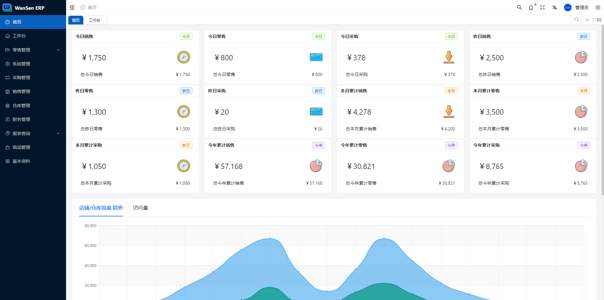
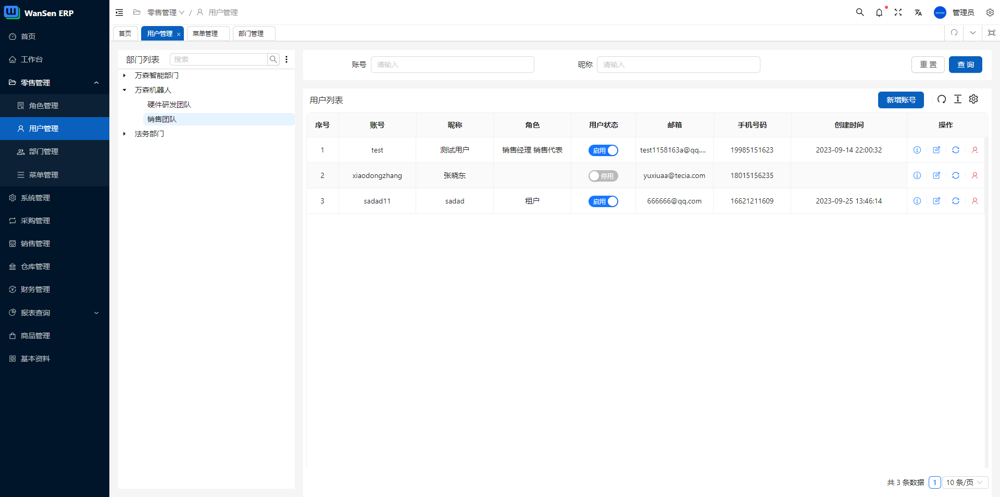
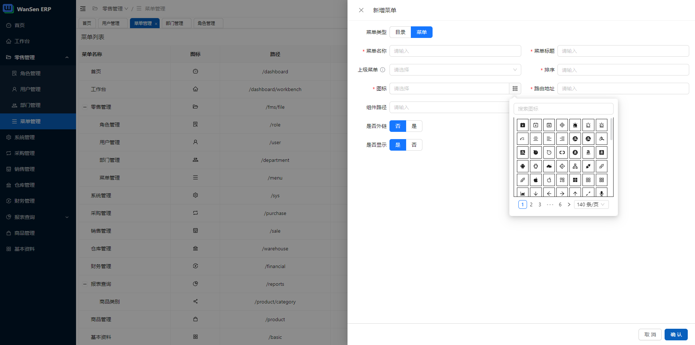
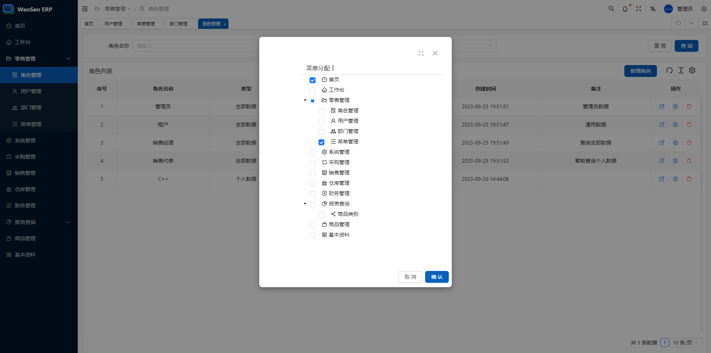

<p align="center">
<!--   <a href="https://www.antdv.com/">
    
  </a> -->
</p>
<h1 align="center">
  <a href="#" target="_blank">Enterprise AI Resource Planning Web</a>
</h1>
<div align="center">
  <!-- nodejs build status-->
  <a href="https://github.com/wansenai/wansen-erp/blob/master/.github/workflows/node.js.yml">
    
  </a>
  <a href="">
    
  </a>
  <a href="">
    
  </a>

</div>

<div align="center">
   <strong>Next generation artificial intelligent ERP system.</strong>
</div>
<br />

## Project

### Quick Start

You can directly use the Docker pull image for quick startup. Here are the commands to pull the front-end image

### Pull images
```shell
docker pull wansenai/eairp-web:latest
```

### Run Server
Please note the `API_BASE_URL` parameter, this is the address mapped by the back-end interface.
```shell
docker run --name eairp-web -d -p 3000:80 -e API_BASE_URL=http://localhost:9998/erp-api wansenai/eairp-web:latest
```
If you want to deploy the API using Docker, you can also pull the API image
```shell
docker pull wansenai/eairp:latest
```
And run API services
```shell
docker run --name eairp -d -p 9998:8088 wansenai/eairp:latest 
```

### Online preview
- [erp-cloud-v2.0.0](https://erp2.wansen.cloud/) - **v2.0.0**
- [erp-cloud-v1.0.1](https://erp.wansen.cloud/) - v1.0.1

### Repository code
- [wansen-erp](https://github.com/wansenai/wansen-erp) - **Current version v2**
- [wansen-erp-core](https://github.com/wansenai/wansen-erp-core) - **Current ERP API**
- [wansen-erp-v1.0.1](https://github.com/wansenai/wansen-erp/tree/v1.0.1) - Before version v1
- [wansen-erp-core-v1.0.1](https://github.com/wansenai/wansen-erp-core/tree/v1.0.1) - Before ERP API v1

## Browser support

The `Chrome 80+` browser is recommended for local development

Support modern browsers, not IE

| [](http://godban.github.io/browsers-support-badges/)</br>IE | [](http://godban.github.io/browsers-support-badges/)</br>Edge | [](http://godban.github.io/browsers-support-badges/)</br>Firefox | [](http://godban.github.io/browsers-support-badges/)</br>Chrome | [](http://godban.github.io/browsers-support-badges/)</br>Safari |
| :-: | :-: | :-: | :-: | :-: |
| not support | last 2 versions | last 2 versions | last 2 versions | last 2 versions |

## System screenshot (only part)






[English](README.md) | [简体中文](./README-zh_CN.md)

## Install and use

- Get the project code

```bash
git clone https://github.com/wansenai/wansen-erp.git
```

- Installation dependencies

```bash
cd wansen-erp

pnpm install

```

- run

```bash
pnpm serve
```

- build

```bash
pnpm build
```
