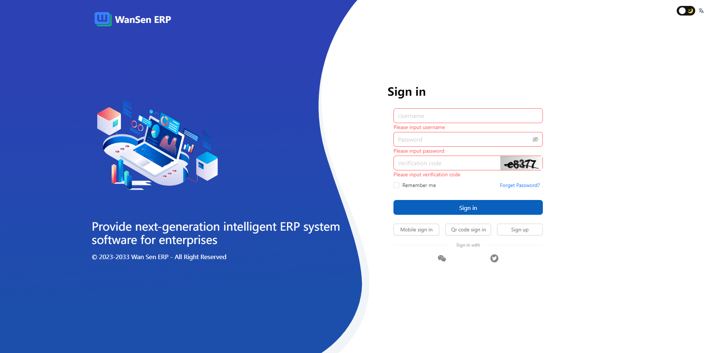

<p align="center">
  <a href="https://www.antdv.com/">
    
  </a>
</p>

<h1 align="center">
  <a href="#" target="_blank">WanSen ERP</a>
</h1>


<div align="center">
  <a href="">
    
  </a>
</div>

<div align="center">
Next generation artificial intelligent ERP system.
</div>
<br />



English | [简体中文](./README-zh_CN.md)

## Project setup
```
npm install -g pnpm

pnpm install
```

### Compiles and hot-reloads for development
```
npm run serve
```

### Compiles and minifies for production
```
pnpm build

pnpm preview
```

### view dist 
```
pnpm preview:dist
```

### Customize configuration
See [Configuration Reference](https://cli.vuejs.org/config/).
